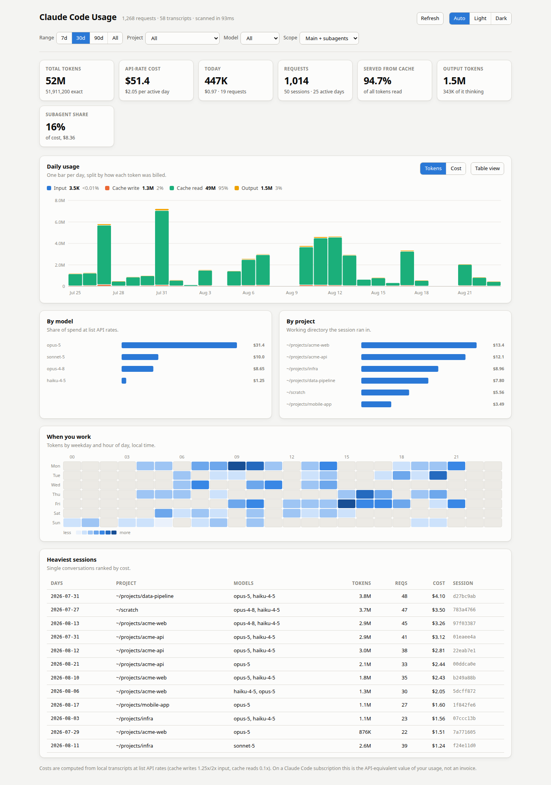
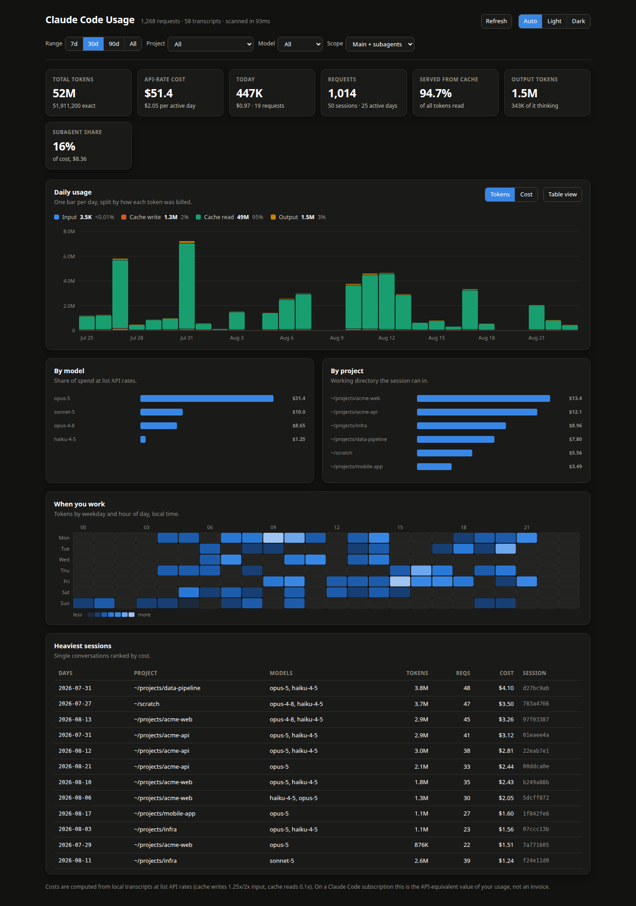

# tokens-monitor

A local, zero-dependency dashboard for the token usage of your own [Claude
Code](https://www.anthropic.com/claude-code) sessions. Reads the JSONL
transcripts Claude Code already writes to disk, computes accurate per-request
token and cost totals, and serves an interactive panel on `localhost`.

Python standard library only. No dependencies to install, no network calls,
nothing leaves the machine.



<details>
<summary>Dark theme</summary>



</details>

*Rendered from synthetic data — see [Demo data](#demo-data).*

## Requirements

- Python 3.8 or newer
- No pip packages — `ccusage.py` and `panel.html` are the whole project

## Install & run

```bash
git clone git@github.com:traczewskim/tokens-monitor.git
cd tokens-monitor
python3 ccusage.py            # serves at http://127.0.0.1:8787
python3 ccusage.py --open     # ...and open a browser automatically
```

By default it reads transcripts from `~/.claude/projects`, which is where
Claude Code stores them. No configuration is required for the common case.

## The panel

- **Auto-refresh** — `Off` / `30s` / `60s` in the header. A heartbeat poll
  re-reads the transcripts on that interval and updates the dashboard in
  place; a small dot shows how long ago the data was refreshed. Polling
  pauses while the tab is in the background and resumes when you come back,
  an unchanged scan re-renders nothing, and a poll that fails leaves the last
  good numbers on screen instead of blanking the page. The choice is
  remembered across reloads.
- **Current session** — the rolling five-hour window Claude Code meters usage
  in, reconstructed from transcript timestamps: tokens, cost and requests
  used so far, and a countdown to the reset. The window opens with the first
  request after an idle stretch, so the card shows *Last session* and the
  time it closed once one lapses. It covers every project and ignores the
  filters.

  Nothing in the transcripts records a plan allowance, so this is **not** the
  usage meter behind `/usage` in Claude Code — it cannot know how much of
  your limit is left. The gauge is scaled against your own heaviest
  five-hour window on record.

## CLI reference

| Flag        | Default              | Description                                    |
|-------------|-----------------------|------------------------------------------------|
| `--host`    | `127.0.0.1`           | Interface to bind. Keep this loopback unless you understand the exposure. |
| `--port`    | `8787`                | TCP port for the panel.                        |
| `--root`    | `~/.claude/projects`  | Directory to scan for `*.jsonl` transcripts.   |
| `--open`    | off                   | Open the panel in a browser after starting the server. |
| `--summary` | off                   | Print a plain-text usage summary to stdout and exit (no server). |
| `--json`    | off                   | Dump the full parsed dataset as JSON to stdout and exit (no server). |

`--summary` and `--json` never start the HTTP server — useful for scripting or
a quick terminal check.

## How it works

Claude Code writes every message to JSONL transcript files under
`~/.claude/projects/<encoded-cwd>/<session-id>.jsonl`. Assistant records carry
a `message.usage` object with `input_tokens`, `cache_creation` (split into
5-minute and 1-hour TTL buckets), `cache_read_input_tokens`, `output_tokens`
and thinking-token counts, alongside `timestamp`, `model`, `cwd`, `sessionId`,
`gitBranch`, and an `isSidechain` flag that marks subagent traffic.

### The key insight: one API response, several JSONL lines

Claude Code appends **one JSONL line per content block** — a thinking block,
a text block, each tool call — not one line per API response. Every line for
the same response repeats the *identical* `usage` object except
`output_tokens`, which grows as the response streams.

Illustrative example: a response with a thinking block, one tool call, and a
final answer might be written as three lines, each reporting
`input_tokens: 1200`, with `output_tokens` climbing `40 → 40 → 260` across the
lines. Naively summing every line would triple-count the 1,200 input tokens
(3,600) and add the output values together instead of taking the final total
(340 instead of 260). Do this across an entire transcript history and totals
end up roughly double the real number.

The fix, in `scan()` in `ccusage.py`: group lines by `requestId` (falling back
to `message.id`, then a file/line key if neither is present), take
input/cache tokens **once** per group, and take the **max** `output_tokens`
seen in the group. Records are also deduplicated across files, which matters
when a session is resumed or forked and earlier lines get copied into a new
transcript.

## Cost model

Costs are computed **locally**, entirely offline, from the `PRICING` table at
the top of `ccusage.py` — USD per million tokens, at first-party Anthropic API
list rates. The standard cache multipliers apply: cache writes are `1.25x`
the input rate for the 5-minute TTL and `2x` for the 1-hour TTL, cache reads
are `0.1x` the input rate. Rates are applied **per record**, so:

- A model can carry a time-limited introductory rate (an `"until"` entry in
  `PRICING`) that applies to records dated on or before a cutoff date, after
  which the standard rate applies.
- A model can carry alternate "fast mode" rates, applied when a record's
  `usage.speed` is `"fast"`.
- Models with no entry in `PRICING` (for example locally synthesized
  messages) are priced at $0 and listed separately as unpriced.

**If you use Claude Code on a subscription plan, this is not a bill.** It is
an estimate of what the same traffic would have cost at list API rates, for
your own reference. Anthropic's actual API pricing can change; edit
`PRICING` when it does.

## Privacy

- Reads only local JSONL transcript files under `--root` (default
  `~/.claude/projects`). It does not read message text or tool output —
  only the numeric usage fields and small pieces of metadata (timestamp,
  model name, working directory, session id, sidechain flag). Git branch
  names are deliberately not collected.
- Makes no network calls. The panel and its data never leave your machine.
- The HTTP server binds `127.0.0.1` by default, and validates the `Host`
  header on every request. A loopback bind alone does not stop DNS
  rebinding — a page on the open web can point its own hostname at
  `127.0.0.1` and read `/api/data`, which lists every project path and
  session id. Requests whose `Host` is not loopback are refused with `403`.
- Only change `--host` if you understand you are exposing token/cost data
  (including project working directories) to whatever network that interface
  reaches. There is no authentication; a non-loopback bind prints a warning.
- The JSON payload served to the browser is the same data described above,
  reshaped into compact arrays for the front end — see
  `docs/ARCHITECTURE.md`.

## Demo data

`tools/make_demo_data.py` writes a synthetic transcript tree with invented
project names, so you can try the panel, produce screenshots, or exercise the
parser without touching real transcripts. Output is deterministic for a given
`--seed`, and it reproduces the multi-line-per-response shape described above.

```bash
python3 tools/make_demo_data.py --out /tmp/demo-projects
python3 ccusage.py --root /tmp/demo-projects
```

The screenshots above were produced this way. Generated `.jsonl` files are
gitignored.

## Contributing

Enable the git hooks after cloning. They block transcripts, session state,
real home paths, and screenshots rendered from real data; on push they also
run a security review over the commits being published:

```bash
git config core.hooksPath .githooks
```

See [CONTRIBUTING.md](CONTRIBUTING.md).

## Configuration

- **Pricing** — edit the `PRICING` dict at the top of `ccusage.py`. Keys are
  normalized model ids (Claude Code date suffixes like `-20251001` are
  stripped automatically), values are `{"in": <$/M tokens>, "out": <$/M
  tokens>}`, with optional `"fast"` (a `(in, out)` tuple) and `"until"` (a
  `(cutoff_date, in, out)` tuple for time-limited rates).
- **`--root`** — point the tool at any directory containing Claude Code style
  JSONL transcripts, useful for testing against a subset or an archived copy.

## Troubleshooting

**"No transcripts directory at ..."** — the `--root` path (or the default
`~/.claude/projects`) does not exist. Confirm Claude Code has been run at
least once on this machine, or pass `--root` to a directory that contains
`*.jsonl` transcripts.

**Empty dashboard / "No usage in this range"** — the transcripts directory
exists but has no matching content within the selected time range filter.
Try the "All" range, or confirm the transcripts actually contain
`message.usage` objects (older or unusual transcripts may not).

**Port already in use** — pick a different port: `python3 ccusage.py --port 8888`.

**Panel loads but shows an error / 500 on `/api/data`** — a transcript file
is likely malformed or unreadable; the server logs nothing to the browser
beyond the error message, so check the terminal running `ccusage.py`. Invalid
JSON lines are already skipped, so this generally indicates a filesystem
permission issue.

## License

MIT.
